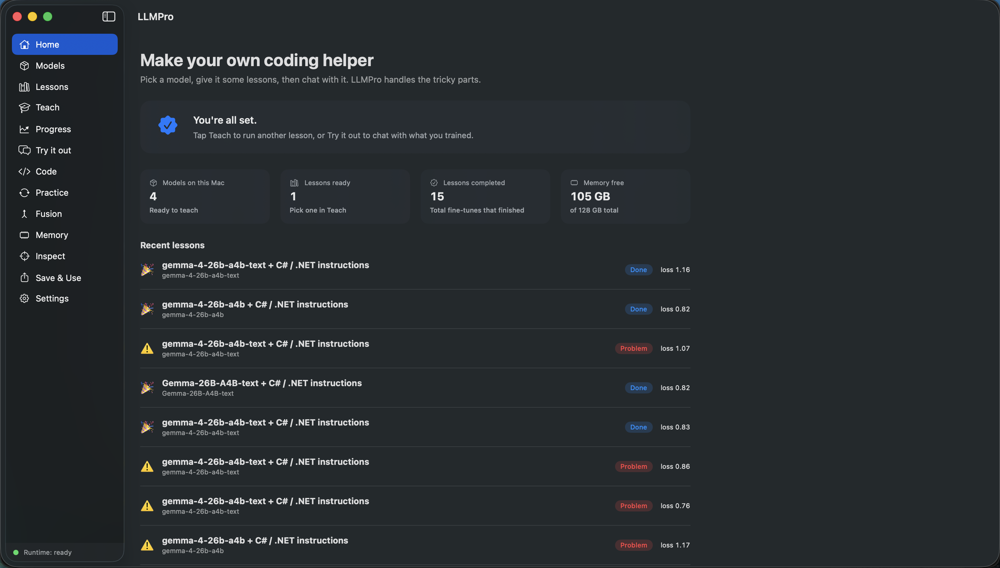
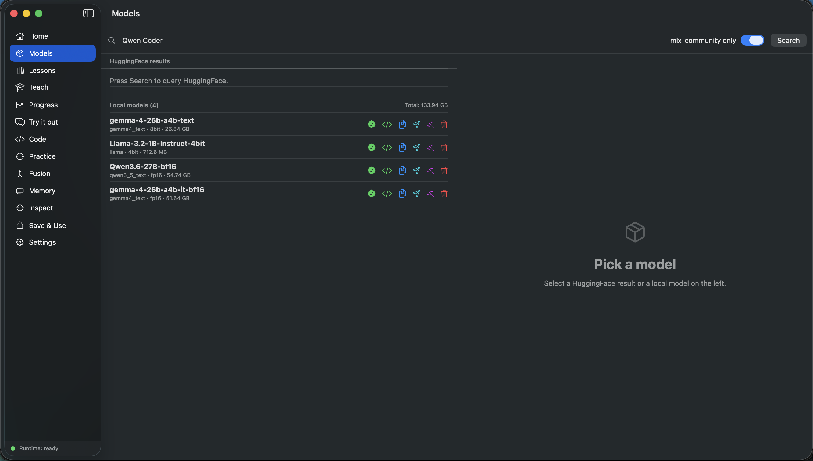
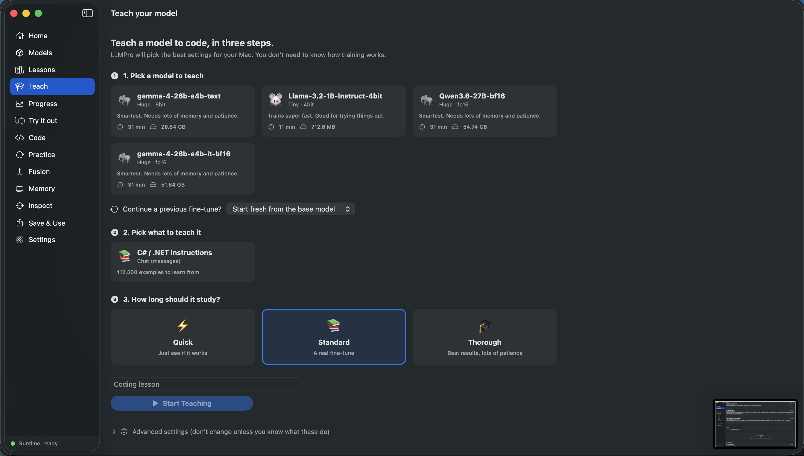
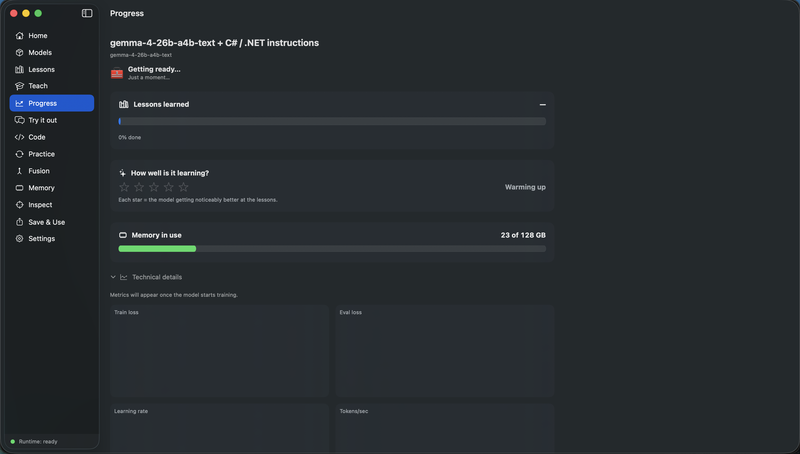
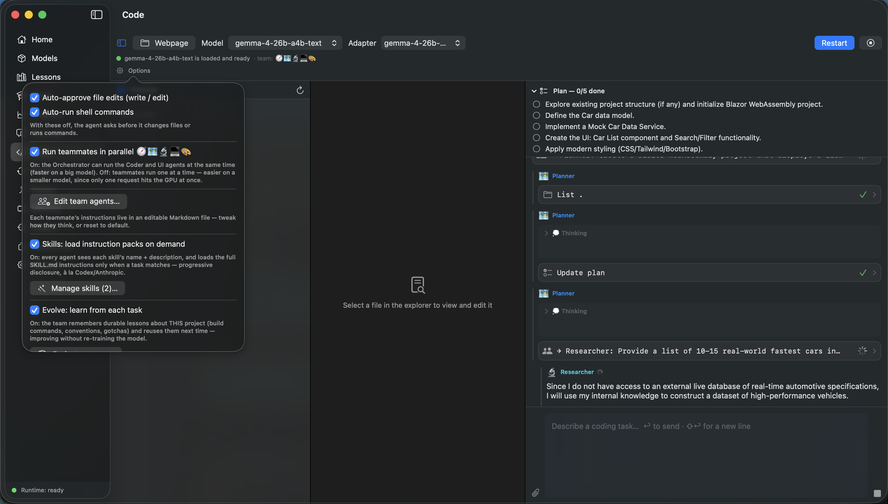
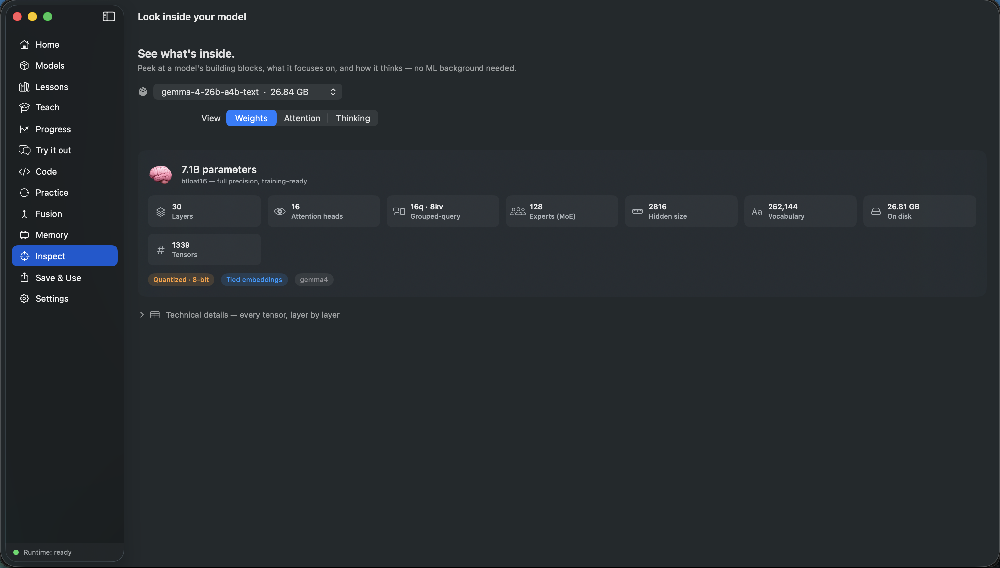
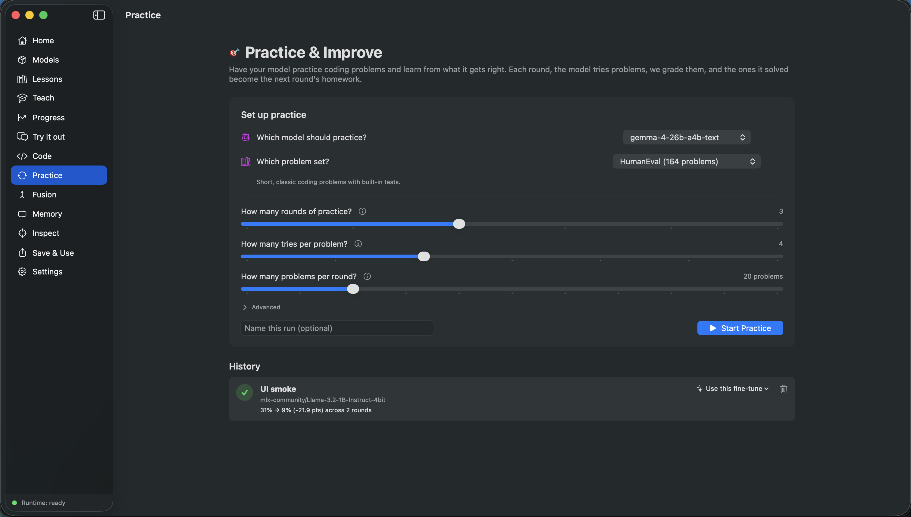
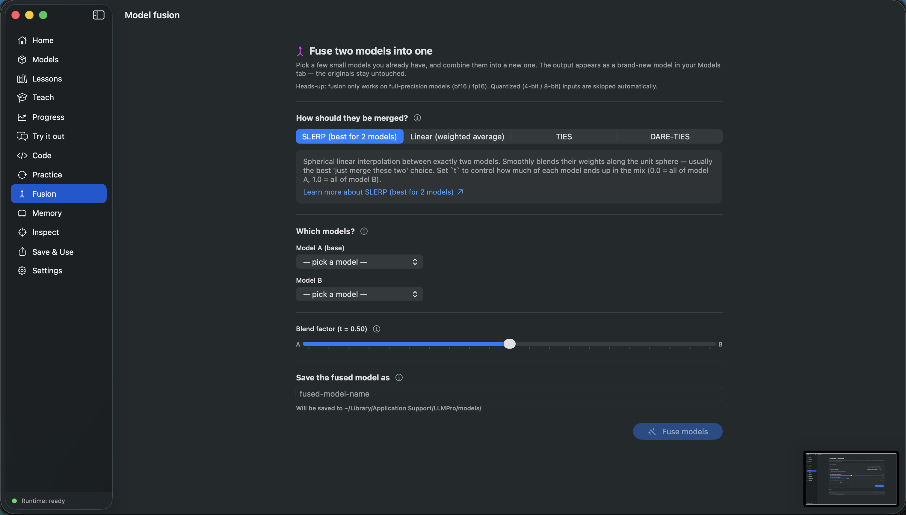

# LLMPro

A native macOS app for fine-tuning local LLMs on Apple Silicon. The Mac equivalent
of [Unsloth Studio](https://github.com/unslothai/unsloth), built on Apple's
[MLX framework](https://github.com/ml-explore/mlx).

**Goal**: take a general-purpose LLM (Llama 3.2, Qwen 2.5 Instruct, Mistral, Gemma)
and teach it to code via LoRA fine-tuning, then run it locally via Ollama or LM
Studio. Most popular open models are general assistants out of the box — LLMPro
specializes them into coding assistants you actually use.

---

> ### 🤖 100% written in Claude Code
> Every line of this project was written by [Claude Code](https://www.anthropic.com/claude-code).
> It works, but it has **not** been hand-audited line-by-line — **expect bugs**, and
> treat it as experimental software. Review the code before running it on anything
> you care about, and please [open an issue](../../issues) if something breaks.

---

> ### 🛠️ Just want to run it on your Mac?
> Follow **[`INSTALL.md`](INSTALL.md)** — a step-by-step, beginner-friendly guide
> that takes you from a fresh Mac to a running app (install prerequisites → build
> → first launch). No prior Xcode experience needed.

---

## Screenshots

The whole app is one closed feedback loop — **download a model → teach it → try it
→ use it for coding** — wrapped in a friendly, no-jargon UI.

### Home
Plain-language dashboard: models on your Mac, lessons ready, fine-tunes completed,
free memory, and recent training runs.



### Models
Search HuggingFace (or filter to `mlx-community`) and manage the models already on
your Mac, with per-model disk usage.



### Teach
Fine-tune in three choices — pick a model, pick a dataset, pick how long. LLMPro
auto-tunes every hyperparameter; there are no knobs to learn.



### Progress
Friendly training narrator with a 5-star "how well it's learning" rating and ETA;
charts and logs live behind a *Technical details* disclosure.



### Code
An agentic coding assistant + 3-pane IDE, driven by a fully-offline five-role team
(Orchestrator · Planner · Researcher · Coder · UI) with editable agents and Skills.



### Inspect
A live MLX model inspector — peek at the weights, attention, and chain-of-thought
of any local model, no ML background required.



### Practice
Recursive self-improvement: the model attempts coding problems, the ones it solves
(verified by real unit tests) become the next round's training data — and pass@1 is
re-measured each round.



### Fusion
Merge two models into a new one (SLERP / linear / TIES / DARE-TIES). The result
shows up as a brand-new model in your Models tab; the originals stay untouched.



> More sections — **Lessons** (dataset catalog + editor), **Try it out** (base-vs-
> fine-tune arena), **Memory**, and **Save & Use** (export to Ollama / LM Studio) —
> are covered in [`docs/WORKFLOWS.md`](docs/WORKFLOWS.md).

---

## Documentation

**Agents and contributors should start with [`CLAUDE.md`](CLAUDE.md)** — the
5-minute orientation. It covers the philosophy, the load-bearing decisions, and
points to the deep-dive docs below.

| Doc | What it covers |
|---|---|
| [`INSTALL.md`](INSTALL.md) | **Start here to run the app** — beginner-friendly build & run guide for any Apple-Silicon Mac |
| [`CLAUDE.md`](CLAUDE.md) | Project mission, the 10 load-bearing decisions, vocabulary, navigation |
| [`docs/ARCHITECTURE.md`](docs/ARCHITECTURE.md) | Every module and file mapped to its responsibility |
| [`docs/WORKFLOWS.md`](docs/WORKFLOWS.md) | Every user action traced through the code |
| [`docs/CONTRACTS.md`](docs/CONTRACTS.md) | External interfaces: mlx-lm CLI, HF API, helper JSON protocol |
| [`docs/CONVENTIONS.md`](docs/CONVENTIONS.md) | Why the code is the way it is — design decisions log |
| [`docs/EXTENDING.md`](docs/EXTENDING.md) | Recipes for adding features without breaking existing ones |
| [`docs/BUILDING.md`](docs/BUILDING.md) | Build, run, and troubleshoot |
| [`docs/STATE.md`](docs/STATE.md) | What's done, what's half-done, known issues, open questions |

---

## Quick start

```bash
# One-time per machine
sudo xcodebuild -license accept
brew install xcodegen

# Generate + build
xcodegen generate
xcodebuild -project LLMPro.xcodeproj -scheme LLMPro \
           -configuration Debug -destination 'platform=macOS' build

# Run
open ~/Library/Developer/Xcode/DerivedData/LLMPro-*/Build/Products/Debug/LLMPro.app
```

On first launch the app walks you through a 5-step wizard:
1. System check (Apple Silicon, macOS 14+, ≥ 16 GB RAM)
2. Python runtime bootstrap (uv venv + mlx-lm install)
3. HuggingFace token (optional)
4. Pick a starter coding model
5. Done

After that, the typical workflow:

1. **Models** → search HuggingFace, download a base model (Llama 3.2 3B for a
   fast first run; Qwen2.5-7B for a meatier one)
2. **Lessons** → pick a curated catalog dataset (CodeAlpaca for fast, Magicoder
   for harder) OR search HuggingFace for any other dataset
3. **Teach** → pick model + dataset + duration (Quick / Standard / Thorough);
   LLMPro auto-picks every hyperparameter
4. **Progress** → watch the training with a friendly 5-star learning rating and
   ETA; technical charts are tucked behind a disclosure
5. **Try it out** → chat with your fine-tuned model in the Arena view
6. **Save & Use** → export to GGUF and one-click install in Ollama

For details: [`docs/WORKFLOWS.md`](docs/WORKFLOWS.md).

---

## Features at a glance

- **HuggingFace browser**, both for models (mlx-community filter or all) and any
  dataset (auto-detects 6 source schemas, normalizes to mlx-lm chat JSONL).
- **Coding-dataset catalog**: 5 curated presets (CodeAlpaca, Magicoder-Evol,
  Magicoder-OSS, evol-codealpaca, Glaive).
- **Dataset CRUD**: create blank, edit rows, add/delete rows, rename, duplicate.
- **AutoTuner** picks every training hyperparameter based on
  (ModelSize, TrainingDuration). The user picks model, dataset, and duration;
  everything else is hidden behind an Advanced disclosure.
- **Friendly Progress UI**: emoji + plain-language phases ("Opening the textbook…",
  "Learning 50 of 200 lessons", "Excellent!"), 5-star learning rating from
  loss-improvement ratio, ETA in plain English.
- **Crash recovery**: orphaned jobs detected on launch via `job.json` sidecars.
- **Model modify** (local-only): strip vision from VLMs, abliterate (uncensor)
  via refusal-direction projection.
- **Local-model management**: delete with confirmation, total-disk display,
  guard against deleting a model that's in active training.
- **Save & Use**: adapter zip / fused safetensors / GGUF with one-click Ollama
  install and built-in Modelfile templates for Qwen / DeepSeek / Llama 3 / Phi /
  Mistral.
- **Practice (recursive self-improvement)**: pick a coding eval (HumanEval / MBPP),
  the model generates K candidates per problem, only solutions that actually pass
  sandboxed unit tests become next-round training data, mlx-lm fine-tunes on the
  passers, pass@1 is re-measured against a held-out set. Friendly progress UI with
  a baseline → R1 → R2 trend chart.
- **Custom app icon** (purple gradient + graduation cap) generated by
  [`tools/make_icon.py`](tools/make_icon.py).

Full status board: [`docs/STATE.md`](docs/STATE.md).

---

## Project layout (brief)

For the full annotated layout see [`docs/ARCHITECTURE.md`](docs/ARCHITECTURE.md).

```
.
├── CLAUDE.md                          ← read me first if you're an agent
├── README.md                          ← this file
├── docs/                              ← all the deep-dive documentation
├── project.yml                        ← XcodeGen project spec
├── tools/make_icon.py                 ← PIL-based icon generator
├── LLMPro/
│   ├── App/                           ← SwiftUI lifecycle
│   ├── Core/                          ← ProcessRunner, PathResolver, LogStreamParser
│   ├── Models/                        ← SwiftData @Model types
│   ├── Services/                      ← Business logic — heart of the app
│   ├── Features/                      ← One folder per sidebar tab
│   │   ├── Dashboard/   (Home)
│   │   ├── Models/
│   │   ├── Datasets/    (Lessons)
│   │   ├── Training/    (Teach)
│   │   ├── Monitor/     (Progress)
│   │   ├── Chat/        (Try it out)
│   │   ├── SelfImprove/ (Practice — recursive self-improvement loop)
│   │   ├── Export/      (Save & Use)
│   │   └── Settings/
│   └── Resources/
│       ├── helpers/                   ← Python helper scripts (JSON-event protocol)
│       ├── recipes/                   ← Coding fine-tune recipe presets
│       └── Assets.xcassets/AppIcon.appiconset/
└── Tests/LLMProTests/              ← empty for now — see STATE.md
```

---

## Requirements

- macOS 14 (Sonoma) or later
- Apple Silicon (M1+)
- Xcode 26+ (Swift 6.0 toolchain)
- `uv` on `$PATH` (or a bundled binary in `Resources/`)
- ~20 GB free disk for the Python venv + at least one base model

Detailed setup + troubleshooting: [`docs/BUILDING.md`](docs/BUILDING.md).

---

## Contributing

This project is maintained mostly by agents in successive sessions, so the
documentation set is load-bearing — it's how knowledge survives between
sessions. **If you change code (or you direct an agent to), you (or it) are
expected to update the relevant docs in the same session.**

Purpose-built specialist subagents live in [`.claude/agents/`](.claude/agents/)
(Builder-Swift, Builder-SwiftUI, Builder-Python, Builder-Text, Planner,
Researcher) — a Claude Code session in this project auto-discovers them and can
delegate file-type-specific work to the matching one. See the
[subagents section](CLAUDE.md#-specialist-subagents-live-in-claudeagents) in
`CLAUDE.md` for the roster and how delegation actually works.

See the [doc-maintenance contract](CLAUDE.md#%EF%B8%8F-documentation-is-part-of-the-work--read-this-section-twice)
in `CLAUDE.md` for the what-triggers-what mapping. Minimum: append one line
to the **Recent session log** in [`docs/STATE.md`](docs/STATE.md) so the next
agent (or you, on the next day) doesn't have to dig through commits to know
what changed.

## License

[MIT](LICENSE) — see the `LICENSE` file. (Set the copyright holder name in
`LICENSE` before publishing; it currently reads `<Your Name>`.)
